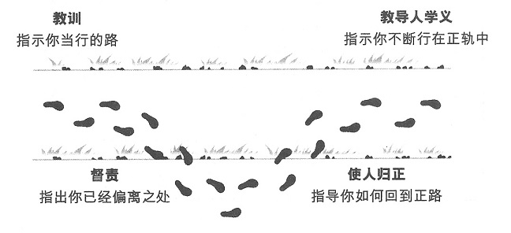

<h2>新生命与读经</h2>

《圣经》是神启示给人类的话语。40多位不同身分的作者，同受一位圣灵的感动，从公元前1430年到公元90年左右，历经1500多年编写完成。

《圣经》是用希伯来文、亚兰文、希腊文3种文字写成的。《旧约》除了《但以理书》和《以斯拉记》的部分内容是用亚兰文写成以外，其余的37卷都是用希伯来文写成的。《新约》则全是用希腊文写成的。

神把《圣经》作为礼物赐给了人类，这并不是为了提高人类的学问或修养，乃是要使人明白神的救恩真理，并为神的儿女们提供在基督里过新生活所需的各项行动指南。

一、神的話語 — 聖經
1. 聖經的來源及意義  
　來源：[提摩太後書3:15](https://www.biblegateway.com/passage/?search=提摩太後書3:15&version=CUVMPS)  
　意義：[提摩太後書3:16-17](https://www.biblegateway.com/passage/?search=提摩太後書3:16-17&version=CUVMPS)  

2. 整本聖經的中心人物  
　[約翰福音5:39](https://www.biblegateway.com/passage/?search=約翰福音5:39&version=CUVMPS)

3. 基督徒對聖經應有的態度  
　[彼得前書2:2](https://www.biblegateway.com/passage/?search=彼得前書2:2&version=CUVMPS)

+ 有關聖經的7個比喻  
1) 腳前的燈，路上的光 — [詩篇119:105](https://www.biblegateway.com/passage/?search=詩篇119:105&version=CUVMPS)  
2) 純淨的靈奶 — [彼得前書2:2](https://www.biblegateway.com/passage/?search=彼得前書2:2&version=CUVMPS)  
3) 屬靈的糧食 — [耶利米書15:16](https://www.biblegateway.com/passage/?search=耶利米書15:16&version=CUVMPS)  
4) 屬靈的財富 — [詩篇119:14](https://www.biblegateway.com/passage/?search=詩篇119:14&version=CUVMPS)  
5) 我們的謀士 — [詩篇119:24](https://www.biblegateway.com/passage/?search=詩篇119:24&version=CUVMPS)  
6) 兩刃的利劍 — [希伯來書4:12](https://www.biblegateway.com/passage/?search=希伯來書4:12&version=CUVMPS)  
7) 我們的詩歌 — [詩篇119:54](https://www.biblegateway.com/passage/?search=詩篇119:54&version=CUVMPS)  

二、舊約與新約

《圣经》分《旧约》和《新约》两部分。《旧约》 39卷,《新约》 27卷,共计66卷(3 x 9 = 27)。

《旧约》记录了宇宙万物的被造、人的被造、人的堕落,以及有关救世主弥赛亚来临的预言等。《新约》是《旧约》的应验,记載了耶稣基督的道成肉身、在世上的工作、十字架上的受死、复活升天和有关主再来的预言及末世的审判等,而且还描述了信徒最后的归宿——天国。

1、《旧约》
《旧约》是律法之约,全书共39卷,由律法书(5卷) 、历史书(12卷)、诗歌智慧书(5卷)和先知书(17卷)组成。《旧约圣经》虽题材众多，但都一脉相承，如真理的河流般，传达出一个最重要的信息，那就是隐藏在《旧约》字里行间的神的救赎计划。

※律法书(摩西五经)  
记载了宇宙和人类的起源、人的堕落、以色列的历史，以及神所启示的各样的律法典章等。循着这一脉络，律法书启示了神永远的计划，就是要拯救人类，建立祂的国度。律法书是这计划的根基，也是这计划的开端。
